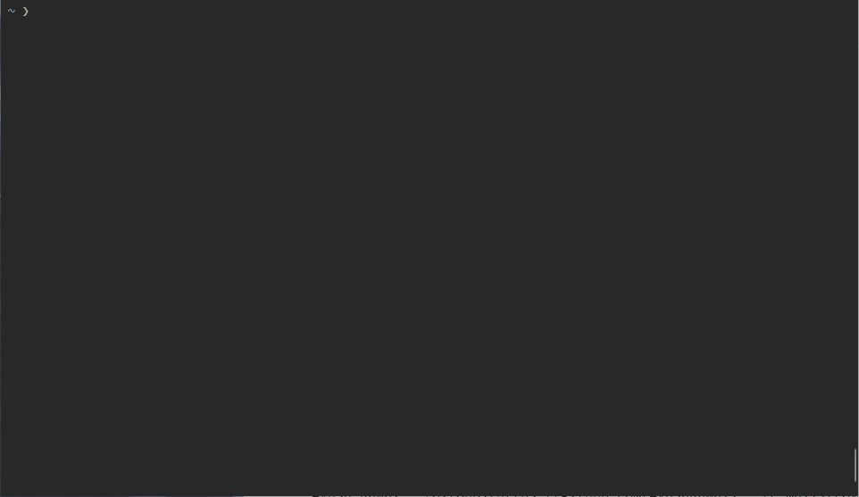

# passman
<a href="https://github.com/AyushRawal/password-manager-cli/issues"></a> <a href="https://github.com/AyushRawal/password-manager-cli/stargazers"></a> <a href="https://github.com/AyushRawal/password-manager-cli/blob/main/LICENSE"></a>  <a href="http://makeapullrequest.com"></a>  

  

Command line client for my password manager.

Check out the password manager [website](https://ayushrawal.github.io/password-manager).

## Demo


## Installation 🛠
Install it using npm
```shell
npm i -g @royalrawal/password-manager-cli
```

## Usage 📑
To use it simply run `passman` from the terminal.

```shell
 Available commands:
                ls -- list all records
                new -- add a new record
                edit [index] -- edit an existing record at [index]
                show [index] -- show an existing record at [index]
                rm [index] -- remove an existing record at [index]
                cp [index] -- copy password to clipboard of an existing record at [index]
                import [filename] -- import records from csv file
                export [filename] -- export records to csv file
                exit -- exit passman
                ?, help -- print this help message
```

## Also check out
The backend repository: [password-manager-backend](https://github.com/AyushRawal/password-manager-backend).

The web frontend repository: [password-manager](https://github.com/AyushRawal/password-manager).

## Support 🙏
Please drop a star ⭐ if you like this project.

## Contributing
Please open an issue before making any major changes.

<br/><p align=center>Made with ❤️ for 🌏 Everyone</p>
